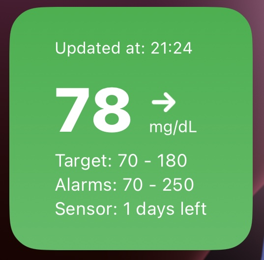
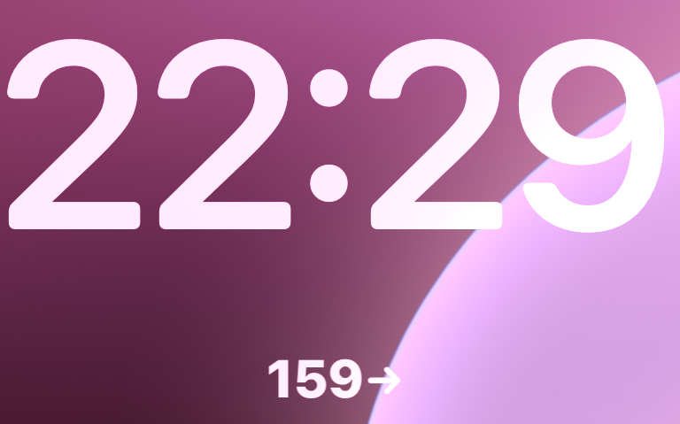

# FreeStyle Libre iOS Widget (Unofficial)

A **Scriptable** widget that displays the latest glucose measurement from [LibreLinkUp](https://www.librelinkup.com), an app designed for parents and caregivers to remotely monitor glucose levels. This widget integrates seamlessly with [FreeStyle Libre](https://www.freestyle.abbott), a popular CGM sensor by Abbott, offering real-time glucose data at a glance.

  
  

---

## 🚀 Setup Instructions

Follow these steps to set up your FreeStyle Libre widget:  

1. **Set up LibreLinkUp**:
   - Download the [LibreLinkUp](https://www.librelinkup.com) app and create an account by following the instructions on the ["Getting Started"](https://www.librelinkup.com/articles/getting-started) page.  
   - Add the newly created account as a **connection** in the **FreeStyle Libre** app to enable glucose data sharing.

2. **Install the Scriptable app**:  
   - Download the [Scriptable app](https://apps.apple.com/app/scriptable/id1405459188) from the App Store.

3. **Create the Script**:  
   - Open Scriptable and tap the **`+`** icon in the top-right corner to create a new script.  
   - Copy the content of the `freestyle-widget.js` file into the editor.

4. **Customize the Script**:  
   - Edit the following constants in the script:
     - `LIBRE_LINK_UP_EMAIL`: Your LibreLinkUp account email.  
     - `LIBRE_LINK_UP_PASSWORD`: Your LibreLinkUp account password.  
     - `CONNECTION_FIRST_NAME`: The first name of the connection.  
     - `CONNECTION_LAST_NAME`: The last name of the connection.  
     - `REGION`: The region of the LibreLinkUp account (valid options: `ae`, `ap`, `au`, `ca`, `de`, `eu`, `eu2`, `fr`, `jp`, `la`, `us`).  

5. **Save the Script**:  
   - Save the script with a name of your choice.

6. **Add the Widget**:  
   - Add a new widget to your home or lock screen.  
   - Select the **Scriptable** app and choose the script you just saved.

7. **Enjoy**:  
   - Your widget is now ready! Stay informed and maintain your **Time In Range (TIR)** 🧃.  

---

## 🔧 Nice to know

- Ensure your LibreLinkUp account credentials are correct and the connection is properly set up in the FreeStyle Libre app.  
- If the widget does not display data, verify that the **FreeStyle Libre** app is still connected to the sensor and to the network.
- The widget updates according to iOS settings, in a variable range.

---

## 📄 License  

This project is licensed under the [GNU General Public License v3.0](LICENSE).  
